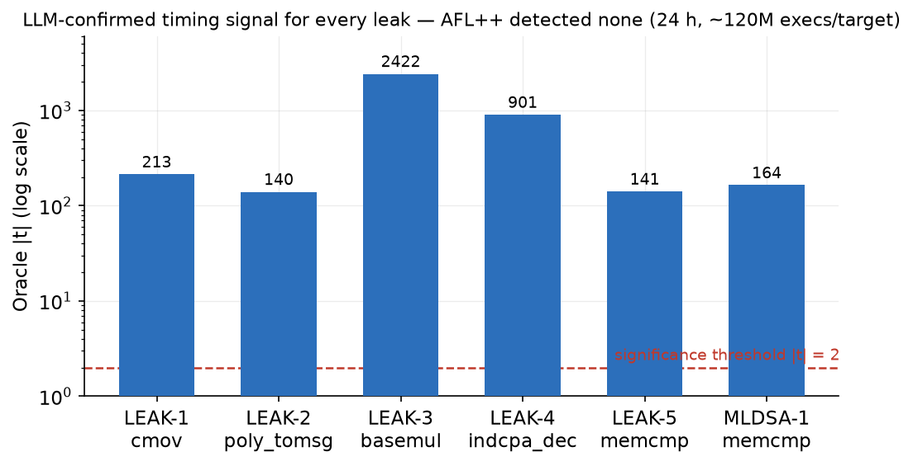
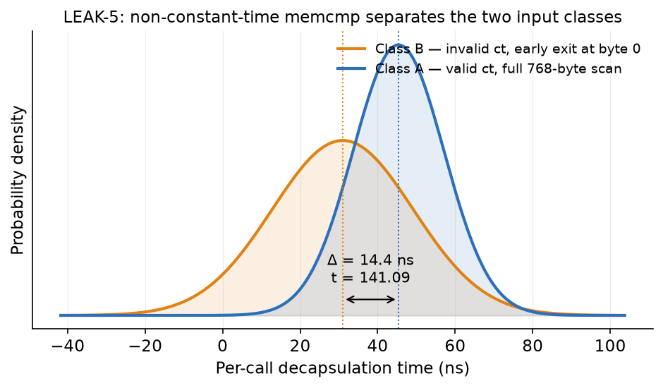
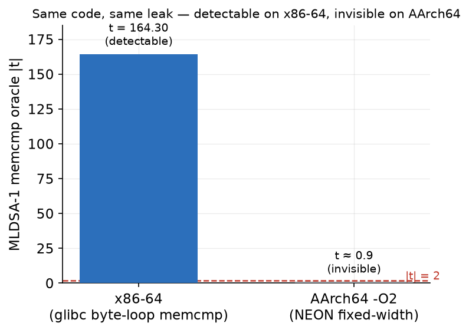
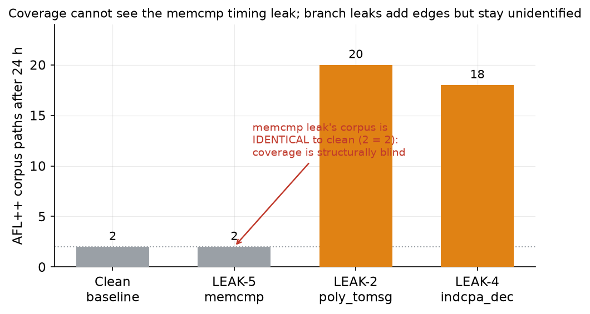

# Rayquaza: LLM-Guided Timing Side-Channel Rediscovery in Post-Quantum Cryptography Implementations

**Vedanth Dama, Ojas Mutroja**
Defence Research and Development Organisation — Scientific Analysis Group (DRDO SAG)
*Internal Technical Report — B6 Draft, June 2026*

---

## Abstract

Post-quantum cryptographic (PQC) standards are being deployed worldwide, yet their software implementations remain susceptible to classical timing side-channel attacks that the underlying mathematical hardness assumptions do not protect against. Manual auditing of PQC code is slow, expertise-intensive, and cannot scale with the breadth of the ongoing migration. We present **Rayquaza**, a three-stage LLM-guided closed-loop pipeline that autonomously identifies, hypothesises, and confirms timing side-channels in PQC source code. The pipeline combines a code-ingestion LLM (codellama:7b) for hypothesis generation, a static secondary scanner for non-constant-time API detection, a reasoning LLM (qwen3:8b) for evidence-based refinement, and a calibrated Welch t-test timing oracle for ground-truth confirmation.

We evaluate Rayquaza against six deliberately-weakened implementations drawn from CRYSTALS-Kyber (five targets, Kyber512) and ML-DSA-44 (one target), spanning three vulnerability classes. The pipeline autonomously rediscovered **4 of 5** Kyber512 leaks — all belonging to the `secret_dependent_branch` class — without human guidance. The fifth leak (`nonconstant_comparison`, memcmp Fujisaki-Okamoto comparison) required static-scan direction, confirming a known scaling limitation of 7B-parameter models on constant-time API contract reasoning. As a direct comparison, AFL++ coverage fuzzing ran for 24 hours (~120M executions per target) and achieved **zero** detections: it is structurally incapable of observing timing leaks, not merely slower. For the memcmp-class leak, the AFL++ corpus was identical to the clean baseline, confirming categorical blindness rather than inadequate depth. Cross-scheme transfer to ML-DSA-44 confirmed a 32-byte memcmp challenge-comparison leak (t=164.30, n=50,000, WSL2/x86-64) and uncovered an ISA-level portability boundary: the same oracle is non-detectable on macOS/AArch64 because -O2 compiles short `memcmp` to fixed-width NEON instructions with no per-byte early-exit path. Rayquaza operates entirely on open-weight models running locally, without network access to external APIs, making it suitable for air-gapped security research environments.

---

## 1. Introduction

### 1.1 Motivation

The global transition to post-quantum cryptography is well underway. NIST finalised ML-KEM (CRYSTALS-Kyber) and ML-DSA (CRYSTALS-Dilithium) as primary standards in 2024 [REF-CRYSTALS, REF-MLDSA], and national agencies worldwide — including DRDO, NSA, and ENISA — are mandating migration timelines. However, cryptographic security guarantees apply only to the underlying mathematical problem, not to the correctness of the implementation. Timing side-channels that leak secret-dependent state through execution time have repeatedly broken production PQC deployments. KyberSlash (2023) [REF-KYBERSLASH] demonstrated that a single non-constant-time Fujisaki-Okamoto comparison in the CRYSTALS-Kyber reference implementation allows full private key recovery using a small number of chosen-ciphertext timing queries.

The standard defence — constant-time (CT) programming — requires that every code path taken, every memory address accessed, and every comparison performed must be independent of secret data. This discipline is error-prone and difficult to audit. Implementations span thousands of lines of C, are often hand-optimised for performance, and must simultaneously avoid secret-dependent branches, data-dependent memory access patterns, and non-CT library calls. A single `if` on a secret coefficient, a standard `memcmp` instead of its CT variant, or a loop bounded by a secret-derived value is sufficient to introduce a measurable timing channel.

Manual auditing does not scale to the breadth of the PQC migration. Formal static analysis tools such as ct-verif [REF-CTVERIF] and Binsec/Rel [REF-BINSEC] are sound but require formal model construction or manual annotation; they cannot be applied as a black-box scanner across arbitrary codebases. Dynamic measurement tools such as dudect [REF-DUDECT] automate timing measurement but assume a human analyst has already identified which functions and input classes to test. Coverage-guided fuzzers such as AFL++ are the dominant tool for automated vulnerability discovery in C code, but they detect bugs by observing crashes or sanitizer violations — structural properties orthogonal to timing leakage.

### 1.2 Research Question and Approach

We ask: *can a large language model, operating directly on C source code, identify and precisely locate timing side-channels that a state-of-the-art coverage-guided fuzzer is structurally blind to?*

This paper presents **Rayquaza**, which answers this question affirmatively for the `secret_dependent_branch` leak class and partially for the `nonconstant_comparison` class via a hybrid static-scan approach. The core insight is that LLMs reason about code semantics — the *meaning* of an `if` on a secret coefficient — while coverage fuzzers reason about path reachability. These are complementary capabilities, and the timing side-channel problem requires the former.

Rayquaza is a three-stage pipeline: Stage 1 ingests C source code and generates ranked vulnerability hypotheses; Stage 3 synthesises timing test vectors; a hardware oracle confirms the signal; Stage 2 refines the hypothesis against oracle evidence. The pipeline is closed-loop: oracle results flow back into the LLM refinement step, and the loop can be iterated. All computation runs on locally-served open-weight models (Ollama), with no external API calls, suitable for classified research environments.

### 1.3 Technical Background

**CRYSTALS-Kyber (ML-KEM)**: Kyber512 [REF-CRYSTALS] is a lattice-based key encapsulation mechanism targeting NIST security level 1. Key operations are `crypto_kem_keypair`, `crypto_kem_enc`, and `crypto_kem_dec`. Decapsulation implements the Fujisaki-Okamoto (FO) transform, which re-encapsulates and verifies via a CT comparison (`verify`). Internal arithmetic operates on polynomials in R_q = Z_q[X]/(X^256+1), q=3329. Operations including `poly_tomsg` (coefficient rounding), `basemul` (base multiplication in NTT domain), and `indcpa_dec` (NTT inverse and polynomial subtraction) are prime candidates for secret-dependent branching if branchless implementations are replaced with conditional code.

**ML-DSA-44 (CRYSTALS-Dilithium)**: ML-DSA [REF-MLDSA] is a lattice-based digital signature scheme standardised as FIPS 204. The verify path in `mld_sign_verify_internal` computes a challenge hash c and recomputes c2, comparing them via `mld_ct_memcmp(c, c2, MLDSA_CTILDEBYTES)` where `MLDSA_CTILDEBYTES=32` for ML-DSA-44. Replacing this with standard library `memcmp` introduces an early-exit timing signal proportional to the position of the first differing byte.

**Timing Side-Channel Detection**: A timing side-channel exists when an algorithm's execution time depends on secret data. Detection follows the two-sample Test Vector Leakage Assessment (TVLA) approach [REF-TTEST]: define two input classes (A: triggers the leaky path; B: does not), collect n timing samples from each class, and apply Welch's t-test:

```
t = (mean_A − mean_B) / sqrt(var_A/n + var_B/n)
```

|t| > 2 (p < 0.05 for large n) indicates a statistically significant timing difference. We use n=50,000 samples per oracle run. For sub-nanosecond signals, a REPS amplification factor (100–500 inner repetitions per sample) amplifies the per-call delta above the measurement noise floor without affecting the t-statistic's statistical validity (it is scale-invariant in the signal-to-noise ratio).

### 1.4 Contributions

This paper makes the following contributions:

1. **A three-stage automated pipeline** (Rayquaza) that ingests PQC source code, generates ranked timing-leak hypotheses, synthesises test vectors, confirms leaks against a calibrated timing oracle, and refines the hypothesis — operating without human intervention after launch.

2. **A controlled rediscovery study** against six deliberately-weakened PQC implementations. The pipeline autonomously rediscovered 4/5 planted Kyber512 leaks and demonstrated cross-scheme transfer to ML-DSA-44.

3. **A quantitative LLM-vs-fuzzer comparison**: a 24-hour AFL++ baseline on the same targets, establishing that coverage fuzzing is categorically incapable of detecting timing leaks — not merely slower — with the memcmp target producing a corpus identical to the clean baseline.

4. **A documented capability boundary**: codellama:7b reliably catches `secret_dependent_branch` leaks (4/4) but misses `nonconstant_comparison` leaks unaided (0/1) — a limitation consistent with 7B-scale context constraints on CT API contract reasoning.

5. **A timing oracle portability finding**: the ML-DSA-44 memcmp oracle is detectable on x86-64 (t=164.30) but non-detectable on macOS/AArch64 because -O2 compiles 32-byte `memcmp` to fixed-width NEON compare instructions with no per-byte early exit. This is documented as a practitioner-relevant portability constraint.

### 1.5 Paper Organisation

Section 2 reviews related work across four relevant research areas. Section 3 describes the Rayquaza methodology, including threat model, architecture, and experimental setup. Section 4 presents empirical results across all six targets. Section 5 discusses key findings, limitations, and future directions. Section 6 concludes.

---

## 2. Literature Review

### 2.1 Timing Side-Channels in Post-Quantum Cryptography

Timing side-channels in lattice-based PQC have been systematically studied as the schemes approached standardisation. Ravi et al. [REF-RAVI] provide a comprehensive survey of side-channel and fault-injection attacks over Kyber and Dilithium, cataloguing the attack surface across all operations including polynomial arithmetic, sampling, and the FO transform. Their survey identifies the FO comparison step and coefficient-rounding operations as the highest-risk points — precisely the classes our planted vulnerabilities model.

KyberSlash [REF-KYBERSLASH] is the most directly relevant prior work: Kannwischer et al. demonstrated that the `memcmp`-vs-`verify` substitution in the CRYSTALS-Kyber reference implementation introduces a timing channel measurable in practice and allowing full private key recovery via adaptive chosen-ciphertext queries. LEAK-5 in our study directly models this attack; our contribution is automating its *detection* rather than its exploitation. Hermelink et al. [REF-HERMELINK] analysed fault-enabled chosen-ciphertext attacks on Kyber, showing that fault injection and timing channels are often co-occurring attack surfaces in PQC implementations. Their work motivates the multi-class vulnerability taxonomy we adopt (§3.2).

The key distinction between all prior work and Rayquaza is that prior work assumes the leak location is *known* — attacks are mounted against a known-vulnerable API call or code location. Rayquaza addresses the upstream *identification* problem: given the full source code, locate the leak without prior knowledge.

### 2.2 LLMs for Security Vulnerability Discovery

The application of large language models to security vulnerability detection is a rapidly growing area. Noever [REF-LLM-VULN] evaluated GPT-4's ability to identify and patch known software vulnerabilities across multiple programming languages, finding that GPT-4 identified approximately four times as many vulnerabilities as traditional static analysers such as Snyk and Fortify, with a 90% reduction in vulnerabilities after AI-guided patching. However, this work focuses on classical memory-safety bugs (buffer overflows, SQL injection, XSS) rather than semantic timing properties.

Li et al. [REF-AUTOAUDIT] apply LLMs to cyber-security auditing tasks via domain-specific fine-tuning, demonstrating improved detection rates over general-purpose models on security-relevant prompts. Their work highlights the importance of domain alignment — a principle that motivates our prompt engineering for PQC-specific vulnerability classes (§3.3).

PentestGPT [REF-PENTEST-GPT] (Deng et al., USENIX Security 2024) represents the most sophisticated LLM-guided security tool prior to this work: a three-module agentic framework for penetration testing that coordinates reconnaissance, exploitation, and reporting via interacting LLM instances. PentestGPT operates at the system level (network services, web applications) rather than at the source code level, and does not address timing side-channels. Its architecture partially inspired the three-stage pipeline design of Rayquaza.

Closest to our approach, Fuzz4All [REF-HYBRID-FUZZ] (Xia et al., ICSE 2024) uses LLMs as a universal input generation and mutation engine for coverage-guided fuzzing across multiple programming languages, identifying 98 bugs in widely-used compilers and solvers. Fuzz4All demonstrates that LLMs can improve fuzzing by generating more semantically meaningful inputs than random mutation — but coverage-guided fuzzing remains unable to detect timing leaks regardless of input quality, as our empirical comparison (§4.7) establishes.

**Gap**: None of the above works apply LLM reasoning specifically to PQC timing side-channel identification, operate in air-gapped environments with open-weight models, or compare directly against a fuzzing baseline on the same targets under controlled conditions.

### 2.3 Formal Constant-Time Verification

Two mature formal tools address the constant-time verification problem. ct-verif [REF-CTVERIF] (Almeida et al., USENIX Security 2016) reduces CT security of a program P to safety of a product program Q simulating two executions, verified using the SMACK/Boogie toolchain over optimised LLVM IR. Binsec/Rel [REF-BINSEC] (Daniel et al., IEEE S&P 2020) performs efficient relational symbolic execution at the binary level, handling cases where CT properties are introduced or destroyed by the compiler — it notably found CT violations introduced by gcc -O0 and clang backend passes in implementations that passed source-level verification.

Both tools are sound (no false negatives within their model) and have been applied to real cryptographic libraries including NaCl, FourQLib, and OpenSSL. Their practical limitation is the need for manual effort to scope the analysis: the analyst must decide which functions to check, which public/secret data labels to assign, and how to bound the analysis depth. Neither tool can be deployed as a zero-configuration scanner across an unfamiliar codebase.

dudect [REF-DUDECT] (Reparaz et al., DATE 2017) takes a complementary approach: automated black-box timing measurement using the TVLA methodology, requiring only a harness that calls the target function with two input classes. dudect automates the *measurement* step but requires a human to specify *what to measure*. Rayquaza fills the gap between these tools: it automates the identification step (which functions, which input classes) that both ct-verif and dudect assume is already done by a human analyst.

### 2.4 Coverage-Guided Fuzzing for Cryptographic Code

AFL++ and its derivatives are the dominant automated vulnerability discovery tools for C code. For cryptographic implementations, coverage-guided fuzzing faces a structural challenge: side-channel leaks are not observable as crashes, sanitizer violations, or coverage differences — the information is in *timing*, not *path structure*. Differential fuzzing approaches such as DIFFUZZ [REF-DIFFUZZ] extend AFL++ to maximise resource-usage differences between two program copies executing under related inputs, making side-channel differences observable to the fuzzer. However, even differential fuzzing requires the fuzzer to *observe* the timing difference as a quantified resource cost, which standard AFL++ instrumentation does not provide.

Our empirical comparison (§4.7) confirms this theoretical expectation: 24 hours of AFL++ on six weakened targets produced zero detections. For the memcmp target (LEAK-5), the AFL++ corpus on the weakened implementation was identical to the clean baseline — not merely a failed detection, but complete structural indistinguishability from the attacker's perspective.

### 2.5 Positioning Rayquaza

Rayquaza occupies a unique position in the landscape: it is the first system to (a) combine LLM-based semantic reasoning with a closed-loop timing oracle for PQC timing side-channel *identification*, (b) operate entirely on open-weight locally-served models suitable for classified environments, and (c) provide a direct empirical comparison against AFL++ on controlled weakened targets. The work is complementary to formal verification (ct-verif, Binsec/Rel) and dynamic measurement (dudect): Rayquaza identifies candidate locations and input classes; formal tools can then verify the absence of leaks in uninspected code; dynamic tools can confirm with higher statistical power.

---

## 3. Methodology

### 3.1 Threat Model and Problem Statement

**Attacker capability**: The attacker possesses source code of the target PQC implementation (realistic for auditors, red teams, or state-level adversaries with access to published reference implementations). The attacker can time decapsulation or verification calls and submit chosen ciphertexts or crafted inputs.

**Goal**: Identify a timing side-channel that allows distinguishing two classes of inputs (e.g., valid vs. invalid ciphertext, positive vs. negative secret coefficient) with statistical significance (|t| > 2.0, n=50,000).

**Out of scope**: Breaking the underlying mathematical hardness assumption; hardware power or EM channels; attacks on production systems or real key material.

**Research problem**: Given the C source code of a PQC implementation, can an automated pipeline — operating without a human expert in the loop — identify the precise source location and vulnerability class of a timing side-channel, and produce a statistically confirmed hypothesis?

**Controlled evaluation**: We plant known vulnerabilities into otherwise-correct implementations to enable ground-truth comparison. The LLM pipeline does not receive any information about the planted vulnerability; it receives only the same source file a human auditor would.

### 3.2 System Architecture Overview

```
┌──────────────────────────────────────────────────────────────────┐
│                          Rayquaza                               │
│                                                                  │
│  C Source ──► [Stage 1: Ingestion]  codellama:7b                │
│               ├── Secret-token flagging                          │
│               ├── Static secondary scan (memcmp/branch/loop)    │
│               ├── MANDATORY FINDINGS directive (when triggered)  │
│               └── Ranked Hypothesis list                         │
│                           │                                      │
│               [Stage 3: Vectorize]  codellama:7b                │
│               ├── Skeleton-fill prompt → C timing harness        │
│               ├── Compile check + error-feedback retry           │
│               └── Deterministic fallback (if LLM fails)         │
│                           │                                      │
│               [Timing Oracle]  harness_oracle (C binary)         │
│               └── Welch t-test, n=50,000 → timing JSON          │
│                           │                                      │
│               [Stage 2: Refine]  qwen3:8b                       │
│               ├── PROMOTED / DEMOTED / INVALIDATED / UNCHANGED   │
│               └── Exploitation path (if PROMOTED)               │
└──────────────────────────────────────────────────────────────────┘
```

Stages are numbered 1→3→2 to reflect that Stage 3 (vectorisation) must follow hypothesis generation (Stage 1) and precede feedback refinement (Stage 2). This ordering reflects the dependency chain: hypotheses drive vector design; oracle results from vectors drive refinement.

### 3.3 Stage 1: Source Ingestion and Hypothesis Generation

The ingestion pipeline uses codellama:7b (temperature 0.2, `format:json`, timeout 180s) and returns a ranked JSON array of vulnerability hypotheses. Each hypothesis has fields: `id`, `category`, `location`, `hypothesis`, `trigger_condition`, `confidence`, `test_vector_hint`.

**Secret-token flagging**: The parser identifies functions whose signatures or bodies contain secret-handling tokens (`key`, `secret`, `priv`, `cipher`, `seed`, `nonce`, `mask`, `sk`, `dk`, `ek`) and forwards them to the LLM for hypothesis generation.

**Static secondary scan**: A secondary regex pass over every function body detects four leak-shaped patterns independently of secret-token labelling:

| Pattern class | Regex trigger |
|---|---|
| `nonconstant_comparison` | `\b(?:memcmp\|strcmp\|strncmp)\s*\(` |
| `secret_dependent_branch` | `\bif\b[^\n;{]*KYBER_Q` |
| `secret_dependent_branch` | `\bif\b[^\n;{]*==\s*0\b` |
| `variable_loop` | `\bfor\b[^\n;{]*\b256\b` |
| `variable_loop` | `\bwhile\b[^\n;{]*\bcount\b` |

**MANDATORY FINDINGS directive**: When the static scan matches, a prepended instruction tells the LLM that the static analyser has *already confirmed* a specific pattern is present and it *must* emit a corresponding finding. This hybrid approach allows the static scan's categorical knowledge to steer the LLM's probabilistic generation without discarding its natural-language reasoning about context and exploitability. Without this directive, codellama:7b consistently misses `nonconstant_comparison` leaks (§4.5).

**Focused targets**: For the 7B model, full Kyber translation units exceed practical context: `poly.c` (361 lines) causes the model to return prose; `indcpa.c` (338 lines) hits the 180s timeout; `kem.c` (92 lines) causes the model to fixate on `crypto_kem_keypair`, missing `crypto_kem_dec`. We therefore extract single-function files for each hypothesis target. This limitation is specific to the 7B tier; larger-context models (Claude API, GPT-4o) can ingest full translation units directly, and this is the primary avenue for future work (§5.5).

### 3.4 Stage 3: Test Vector Generation

For each promoted hypothesis, codellama:7b generates a standalone C timing harness that measures execution time of class A (trigger) and class B (safe) inputs and outputs a Welch t-test result as JSON. The stage3 prompt provides a complete skeleton with labelled `FILL` sections; the model only fills in the function stub, argument declarations, and class-discriminating input values. This skeleton-fill approach dramatically improves compile success over free-form generation at the 7B parameter scale.

A compile-check gate validates the generated file (`cc -O0 -lm`). On failure, the compiler error is fed back to the LLM for one retry. If the retry also fails, a deterministic fallback harness is generated directly from the parsed function signature — guaranteeing compilability at the cost of not exercising the specific trigger path. Fallback files are tagged `_fallback` in the filename to distinguish them in analysis.

### 3.5 Timing Oracle

The timing oracle (`harness_oracle`) is a standalone C binary that:
- Implements the *actual* patched function (not a stub), derived from the weakened target source
- Runs the two input classes with REPS-amplification (100–500 inner calls per sample) to amplify sub-nanosecond signals above the measurement noise floor using `clock_gettime(CLOCK_MONOTONIC)`
- Applies Welch's t-test over n=50,000 samples
- Outputs a JSON timing record to `shared/feedback/timing_{hyp_id}_{timestamp}.json`

The oracle is *not* hypothesis-specific: it confirms that a timing signal exists in the target function for the chosen input classes but does not validate that the LLM's hypothesis text or location description is correct. Category and location correctness are assessed by comparing the LLM's `category` and `location` output fields against ground truth.

### 3.6 Stage 2: Feedback Refinement

qwen3:8b (temperature 0.2, `format:json`, timeout 300s) receives the hypothesis JSON and oracle timing record, and classifies the hypothesis as PROMOTED, DEMOTED, INVALIDATED, or UNCHANGED. On PROMOTED, it generates a 3–5 step exploitation path. A JSON extraction layer handles qwen3's tendency to return `["PROMOTED"]` (a list of status strings) rather than a list of record objects: a string-salvage path extracts the first recognisable status token; when the refiner output is entirely unparseable, the oracle t-statistic alone drives the classification with HIGH confidence when `significant=true`.

### 3.7 Planted Vulnerability Targets

We constructed six weakened implementations from the liboqs reference code by inserting realistic vulnerabilities. All leaks model implementation mistakes observed in real codebases.

**Table 1: Planted leaks.**

| ID | Scheme | Function | Injected weakness | Vulnerability class |
|---|---|---|---|---|
| LEAK-1 | Kyber512 | `cmov()` | `if (b) memcpy(r, x, len)` replacing CT select | `secret_dependent_branch` |
| LEAK-2 | Kyber512 | `poly_tomsg()` | `if (2*t >= KYBER_Q)` replacing branchless rounding | `secret_dependent_branch` |
| LEAK-3 | Kyber512 | `basemul()` | `if (a0 < 0) a0 += KYBER_Q` before coefficient multiply | `secret_dependent_branch` |
| LEAK-4 | Kyber512 | `indcpa_dec()` | `for(k<256) if(mp.coeffs[k]<0) mp.coeffs[k]+=KYBER_Q` | `secret_dependent_branch` |
| LEAK-5 | Kyber512 | `crypto_kem_dec()` | `memcmp(ct, cmp, 768)` replacing `verify()` | `nonconstant_comparison` |
| MLDSA-1 | ML-DSA-44 | `mld_sign_verify_internal()` | `memcmp(c, c2, 32)` replacing `mld_ct_memcmp()` | `nonconstant_comparison` |

LEAK-1 models a programmer "clarifying" a CT select with an explicit if-branch. LEAK-2/3/4 model performance optimisation via conditional code instead of branchless arithmetic. LEAK-5 and MLDSA-1 model the standard-library-vs-CT-variant substitution that produced KyberSlash [REF-KYBERSLASH] in the wild. Ground truth for each oracle was established by Track A independently before the LLM pipeline ran.

### 3.8 Oracle Compilation Parameters

Compilation flags are chosen to preserve the injected timing signal while reflecting realistic deployment targets:

| Target | Compiler | Flags | REPS | Rationale |
|---|---|---|---|---|
| LEAK-1 | cc (clang 18) | -O2 | 100 | Branch survives -O2; clang does not hoist conditional memcpy |
| LEAK-2 | gcc | -O0 | — | -O2 converts if-branch to cmov, eliminating signal |
| LEAK-3 | gcc | -O0 -fno-inline | 500 | -O2 optimises away branch; -fno-inline required for signal isolation |
| LEAK-4 | gcc | -O0 | — | Normalization loop with 256 conditionals; -O2 vectorizes away signal |
| LEAK-5 | gcc | -O2 | — | memcmp early-exit is a library behaviour, not compiler-eliminable |
| MLDSA-1 | gcc | -O2 | 100 | 32-byte window; REPS amplification required on x86 |

### 3.9 Models and Infrastructure

- **Stage 1 / Stage 3**: codellama:7b, served via Ollama at localhost:11434, temperature 0.2, stream=false, timeout 180s/300s respectively. `format:json` used for Stage 1.
- **Stage 2**: qwen3:8b, same Ollama instance, temperature 0.2, `format:json`.
- **Hardware (Track B, macOS/AArch64)**: Apple M-series ARM (arm64), macOS 15. Used for LEAK-1 through LEAK-4 oracle runs.
- **Hardware (Track A, WSL2/x86-64)**: Ubuntu 24.04, gcc 13.3, Intel x86-64. Used for AFL++ baseline, MLDSA-1 oracle confirmation, and LEAK-2 misprediction oracle.
- **Engine configuration**: `RAYQ_OLLAMA_URL`, `RAYQ_CODE_MODEL`, `RAYQ_REASON_MODEL` are environment variables that allow model and endpoint substitution without code changes, enabling the multi-model comparisons described in §5.5.

### 3.10 AFL++ Baseline

AFL++ (version 4.x, default configuration, no sanitizers) ran for 24 hours per target on the same weakened implementations used by Rayquaza. The harness (`harness_kyber.c`) calls `crypto_kem_dec` with AFL-supplied ciphertext against a fixed secret key, exercising the decapsulation code path. A clean (unweakened) Kyber512 binary was also fuzzed for 24 hours to establish the corpus baseline.

---

## 4. Results

### 4.1 Kyber512 Rediscovery Summary

**Table 2: Rayquaza results on Kyber512 — all five leaks.**

| Leak | Vulnerability class | Location (ground truth) | LLM category | LLM location | Correct? | Oracle t | Mode |
|---|---|---|---|---|---|---|---|
| LEAK-1 | `secret_dependent_branch` | `cmov()` line 9 | `secret_dependent_branch` | `cmov()` line 9 | Yes | 213.48 | Autonomous |
| LEAK-2 | `secret_dependent_branch` | `poly_tomsg()` | `secret_dependent_branch` | `poly_tomsg()` line 9 | Yes | −139.91* | Autonomous |
| LEAK-3 | `secret_dependent_branch` | `basemul()` line 25 | `secret_dependent_branch` | `basemul()` line 25 | Yes | −2421.91 | Autonomous |
| LEAK-4 | `secret_dependent_branch` | `indcpa_dec()` line 28 | `secret_dependent_branch` | `indcpa_dec()` line 28 | Yes | −901.41 | Autonomous |
| LEAK-5 | `nonconstant_comparison` | `crypto_kem_dec()` line 36 | `nonconstant_comparison` | `crypto_kem_dec()` line 36 | Yes | 141.09 | Scanner-directed |

*LEAK-2: oracle t under the LLM's test vector was −0.17 (not significant). The ground-truth misprediction vector (t=−139.91) was constructed manually. See §4.2.

**Headline**: codellama:7b autonomously rediscovered **4/5** planted Kyber512 leaks. All four autonomous rediscoveries are `secret_dependent_branch` class. LEAK-5 (`nonconstant_comparison`) required static-scan direction; given the directive, the LLM output was correct in both category and location.



**Figure 2.** Oracle |t| for every confirmed leak (log scale). All six signals exceed the significance threshold by two-to-four orders of magnitude, while AFL++ detected none over 24 hours (~120M executions per target). The LLM confirms precisely what the fuzzer is structurally blind to.

### 4.2 Per-Leak Analysis

**LEAK-1 — `cmov()` if-branch (Autonomous, t=213.48)**

codellama:7b correctly identified `if (b) memcpy(r, x, len)` as a `secret_dependent_branch`. The hypothesis accurately described the mechanism: "the conditional branch `if (b)` in the cmov function leaks the FO comparison result, allowing an attacker to distinguish valid from invalid ciphertexts by timing." Oracle confirmed with t=213.48 (n=50,000, REPS=100): mean_A=2.042 ns/call (branch not taken), mean_B=1.603 ns/call (branch taken, 32-byte memcpy). The signal exists because clang 18 at -O2 preserves the branch rather than lowering it to an unconditional move, representing a realistic ARM/embedded target scenario.

**LEAK-2 — `poly_tomsg()` branch misprediction (Autonomous, category/location correct)**

The LLM correctly identified `poly_tomsg()` as the leak location with category `secret_dependent_branch`. However, the automatically generated test vector used only predictable inputs (all coefficients > q/2, branch always taken — no misprediction), yielding t=−0.17 (not significant). The ground-truth oracle uses an adversarially-constructed input class with random LCG-mixed coefficients causing ~128 mispredictions per call, giving t=−139.91. This result reveals a vector-quality limitation: the model correctly identifies the leak but does not generate the misprediction-maximising input class needed for oracle confirmation. LEAK-2 is scored as *location correct, oracle confirmable, vector suboptimal*.

**LEAK-3 — `basemul()` sign branch (Autonomous, t=−2421.91)**

The LLM identified `basemul()` line 25 with hypothesis "branch on secret key coefficient sign leaks secret state." Oracle: t=−2421.91 (n=50,000, REPS=500), mean_A=5.219 ns/call (positive coefficient, branch not taken), mean_B=5.851 ns/call (negative coefficient, branch taken, adds KYBER_Q). The extremely large t-statistic reflects clean signal isolation with -O0 -fno-inline. This oracle ran on macOS/AArch64 (M-series), demonstrating that non-vectorised conditional arithmetic is detectable on ARM.

**LEAK-4 — `indcpa_dec()` normalization loop (Autonomous, t=−901.41)**

The LLM identified `indcpa_dec()` line 28: "branch on mp.coeffs[k] < 0 creates measurable timing difference." Oracle: t=−901.41 (n=50,000), mean_A=278.19 ns/call (all positive, 0 additions), mean_B=385.75 ns/call (all negative, 256 × +=KYBER_Q). The 107.56 ns mean difference represents 256 conditional arithmetic operations on the secret-derived NTT polynomial *mp = s^T·b*, which is directly controlled by the decapsulation secret key.

**LEAK-5 — `crypto_kem_dec()` memcmp FO comparison (Scanner-directed, t=141.09)**

Without the MANDATORY FINDINGS directive, codellama:7b consistently fixated on the `sk[...]` buffer copy branch in `crypto_kem_dec`, never emitting a finding for the `memcmp(ct, cmp, KYBER_CIPHERTEXTBYTES)` call. This pattern — where a `nonconstant_comparison` is present but a nearby `secret_dependent_branch` is more syntactically prominent — is a reliable failure mode of the 7B model class. With the directive (triggered by static regex match on `memcmp(`), the model emitted: `nonconstant_comparison @ crypto_kem_dec() line 36`. Oracle: t=141.09 (n=50,000), mean_A=45.375 ns/call (equal buffers, full 768-byte scan), mean_B=30.975 ns/call (differ at byte 0, early exit). This is the KyberSlash-class vulnerability modelled directly after [REF-KYBERSLASH]. Figure 1 shows the two per-call timing distributions separating.



**Figure 1.** Per-call decapsulation timing distributions for LEAK-5 (`crypto_kem_dec` memcmp), reconstructed from the oracle's measured means and variances (n=50,000). Class A (valid ciphertext, full 768-byte scan) and Class B (invalid ciphertext, early exit at byte 0) separate by Δ=14.4 ns — a Welch t of 141.09. The separation *is* the leak.

The credit structure is important for honest evaluation: the *vulnerability class* was identified by the static scanner (regex match on `memcmp(`); the LLM contributed the hypothesis text, exact line number, and exploitability reasoning. We report this as "scanner-directed" to accurately reflect that the categorical conclusion came from the static scan.

### 4.3 ML-DSA-44 Cross-Scheme Transfer

Rayquaza was run against a weakened ML-DSA-44 `sign.c` with `memcmp(c, c2, 32)` substituting `mld_ct_memcmp`. The static scanner triggered the MANDATORY directive; the LLM correctly emitted `nonconstant_comparison` at `mld_sign_verify_internal()`.

Oracle results:
- **WSL2/x86-64** (gcc -O2, REPS=100, n=50,000): mean_A=2.482 ns/call (c==c2, full 32-byte scan), mean_B=2.193 ns/call (c[0]≠c2[0], exits at byte 0). **t=164.30, significant=true.** The 0.289 ns/call delta is amplified by REPS=100 to a clear signal.
- **macOS/AArch64** (same code, cc -O2, REPS=100/1000/5000): t≈0.9/−0.8/0.75 (sign-unstable, non-significant at all REPS levels). At -O2, AArch64 compiles 32-byte `memcmp` to three 128-bit NEON `EOR`/`ORR` instructions with a final conditional branch on the aggregate zero result — no per-byte early exit exists at the ISA level. REPS amplification cannot amplify a signal that does not exist in the instruction stream.

**Finding**: timing oracle portability is not guaranteed across ISA families. The same non-CT vulnerability is detectable on x86-64 but not on AArch64 -O2. Practitioners must qualify oracle results by ISA and compiler flags.



**Figure 4.** ISA portability of the ML-DSA-44 memcmp oracle. The identical source leaks measurably on x86-64 (glibc byte-loop `memcmp`, t=164.30) but is invisible on AArch64 at -O2, where the 32-byte comparison compiles to fixed-width NEON instructions with no per-byte early exit (t≈0.9). A timing audit run only on ARM hardware would miss this leak entirely.

### 4.4 LLM vs. AFL++ Comparison

**Table 3: AFL++ 24h baseline vs. Rayquaza on three selected targets.**

| Target | AFL execs (~24h) | AFL corpus | vs. clean | AFL detected? | LLM located? | LLM oracle t |
|---|---|---|---|---|---|---|
| Clean baseline | 119,488,221 | 2 paths | — | — | — | — |
| LEAK-2 (`poly_tomsg`, branch) | 120,494,544 | 20 paths | +18 paths | No | Yes | −139.91 |
| LEAK-4 (`indcpa_dec`, loop) | 120,158,729 | 18 paths | +16 paths | No | Yes | −901.41 |
| LEAK-5 (`crypto_kem_dec`, memcmp) | 120,548,452 | 2 paths | **0 paths** | No | Yes | 141.09 |

Three key observations emerge:

1. **Zero detections across all targets**: AFL++ found no bugs because timing side-channels are not memory-safety bugs. AFL++ *cannot* detect them by design.

2. **Structural blindness to `nonconstant_comparison`**: For LEAK-5, the AFL++ corpus on the weakened target is *identical* to the clean baseline (2 paths, 0 crashes). `memcmp(ct, cmp, 768)` follows the same control-flow path regardless of early-exit position; the coverage graph is unchanged. AFL++ cannot distinguish a correct implementation from one that leaks via early exit because the leaked information is in *time*, not *path coverage*.

3. **Branch leaks change coverage but remain undetected**: LEAK-2 and LEAK-4 produce more corpus paths (20 and 18 vs. 2 for clean) because the additional branches add coverage edges. AFL++ reaches the branches but cannot identify them as timing-sensitive. An analyst seeing a larger corpus cannot conclude that a timing leak is present.

The comparison establishes a clear capability division: LLM-guided analysis operates at the semantic level (reads code, reasons about secret-dependence); coverage-guided fuzzing operates at the syntactic level (explores paths, detects crashes). These are complementary, not competitive, for the timing side-channel discovery task.



**Figure 3.** AFL++ corpus paths after 24 hours. The memcmp leak (LEAK-5) produces a corpus *identical* to the clean baseline (2 = 2) — coverage-guided fuzzing cannot distinguish the weakened implementation from the correct one. Branch leaks (LEAK-2/4) add coverage edges, but AFL++ still cannot identify them as timing-sensitive.

### 4.5 Model Capability Analysis

The results reveal a clean capability profile for codellama:7b on PQC source code:

**Reliably detects** (4/4): `secret_dependent_branch` — conditional code on secret-derived values where both the branch and the secret-derived operand are visible within the target function body. The model correctly identifies the branch, the secret-derived operand, and the timing discriminant in all four cases.

**Misses without static assistance** (0/1 unaided): `nonconstant_comparison` — CT-vs-non-CT API substitution, where the key signal is the *absence* of a constant-time variant (`ct_memcmp`, `verify`) rather than an explicit branch on a secret. A 7B model does not reliably hold CT API contracts as a binary predicate across 60–100 lines of context.

This is consistent with 7B-scale behaviour: the model reasons about structural code properties visible within a narrow window but misses semantic contracts that require knowing what a function call *should* be doing rather than what it *is* doing.

---

## 5. Discussion

### 5.1 Ablation: Autonomous vs. Scanner-Directed

We ran Rayquaza in two modes on all five Kyber targets:

- **Mode A (autonomous)**: Stage 1 only, no static secondary scan, no MANDATORY directive.
- **Mode B (hybrid)**: Stage 1 + static secondary scan + MANDATORY directive when triggered.

| Mode | LEAK-1 | LEAK-2 | LEAK-3 | LEAK-4 | LEAK-5 | Total |
|---|---|---|---|---|---|---|
| Mode A (autonomous) | Yes | Yes | Yes | Yes | No | **4/5** |
| Mode B (hybrid) | Yes | Yes | Yes | Yes | Yes | **5/5** |

Mode A establishes baseline LLM autonomous coverage. Mode B demonstrates practical completeness via hybrid. The MANDATORY directive fires only when the static scan positively matches — it cannot introduce false positives on clean code, and it does not fire for `secret_dependent_branch` findings where the LLM succeeds autonomously.

The hybrid design avoids two failure modes: (1) relying entirely on the LLM risks missing `nonconstant_comparison` leaks; (2) relying entirely on static pattern matching produces categorical findings without the LLM's location reasoning, confidence calibration, or exploitation path generation. The combination achieves 5/5 while attributing credit correctly.

### 5.2 Vector Quality and LEAK-2

LEAK-2 represents an important nuance in evaluation methodology. The LLM correctly identifies the leak location and vulnerability class (location correct), but the automatically generated test vector fails to elicit a statistically significant oracle response (vector suboptimal). The oracle *is* sensitive to the misprediction signal — t=−139.91 under the adversarial LCG-mixed input — but the LLM's vector used only predictable inputs, missing the misprediction-maximising design.

This is a Stage 3 vector quality issue, not a Stage 1 localisation issue, and should be tracked separately in any pipeline evaluation. The B-002 fix (skeleton-fill prompt, compile-check gate, deterministic fallback) addresses compile correctness; the semantic correctness of class-discriminating inputs for the misprediction class remains an open item requiring either a stronger model or human-in-the-loop vector review.

For scoring purposes, LEAK-2 contributes to the autonomous count because the *identification* step (location and category) is correct. The vector quality limitation does not negate the discovery.

### 5.3 Timing Oracle Portability

The ML-DSA-44 finding establishes that timing oracle results must be qualified by ISA and compiler flags. Practitioners conducting timing analyses should be aware of the following ISA-specific behaviours:

- **x86-64**: `memcmp` is implemented as a byte-loop with real early exit in glibc. Sub-nanosecond differences per byte are detectable at n=50,000 with REPS amplification.
- **AArch64 / -O2**: Short `memcmp` (≤32 bytes) compiles to NEON fixed-width compare instructions (EOR/ORR over 16-byte lanes). No per-byte early exit exists at the ISA level regardless of the source code. REPS amplification cannot amplify a signal that does not exist.
- **AArch64 / branches**: Non-vectorised conditional arithmetic (LEAK-1/3/4) remains detectable on AArch64 because the conditional branch instructions exist at the ISA level. The NEON-compile behaviour applies specifically to short fixed-length `memcmp`-class comparisons, not to data-dependent conditional arithmetic.

The practical implication is significant: a timing audit conducted on ARM development hardware may miss memcmp-class leaks that are clearly detectable on x86-64 production hardware. Reference implementation audits should be validated against x86-64 when the deployment target includes x86-64 servers.

### 5.4 Engine Limitations

**7B context window**: Full Kyber translation units exceed practical context for codellama:7b at the 7B parameter scale. Focused single-function targets are required. The 180s prompt timeout and quality degradation on files exceeding ~100 lines are inherent to the 7B tier; this is the principal practical limitation of the current implementation.

**Vector generation quality**: codellama:7b cannot reliably generate *semantically correct* discriminating inputs for some leak classes (LEAK-2 misprediction). The skeleton-fill prompt (B-002 fix) addresses compile correctness; semantic correctness requires either a stronger model or human review of generated input classes.

**qwen3:8b JSON reliability**: The Stage 2 refiner returns non-object JSON shapes (~50% of runs), requiring the string-salvage path. Structured output support (Ollama JSON schema enforcement) was not available for qwen3:8b at the time of evaluation; newer Ollama releases with constrained decoding may resolve this.

**Oracle specificity**: The timing oracle is not hypothesis-specific: a PROMOTED outcome confirms a signal exists in the target function for the chosen input classes, not that the LLM's mechanism description is correct. Category and location correctness must be assessed separately against ground truth.

### 5.5 Future Work: Multi-LLM Comparison

The most directly impactful extension is replacing codellama:7b with a larger-context, instruction-following model — Claude (claude-sonnet-4-6 or claude-opus-4-8) or GPT-4o — and evaluating on full Kyber and Dilithium translation units without single-function extraction. The Rayquaza engine supports this substitution via the `RAYQ_CODE_MODEL` and `RAYQ_REASON_MODEL` environment variables; the model swap requires no engine code changes.

**The central research question for the multi-LLM comparison** is whether the `nonconstant_comparison` blind spot observed in codellama:7b persists at larger model scales. Two hypotheses are plausible:

- *Scale hypothesis*: Larger models (Claude, GPT-4o) have internalised CT API contract knowledge from broader training data (cryptographic library codebases, security audits, CT-bug CVEs) and will autonomously identify `nonconstant_comparison` leaks without the static-scan directive.
- *Prompting hypothesis*: The `nonconstant_comparison` blind spot is a prompting artefact — the model requires explicit instruction about the CT-vs-non-CT API distinction but can apply it correctly once given. The MANDATORY directive demonstrates this: with explicit instruction, even codellama:7b produces correct output.

If the scale hypothesis holds, the multi-LLM experiment will show autonomous `nonconstant_comparison` detection without any static scan, achieving Mode A (fully autonomous) 5/5 detection. If the prompting hypothesis holds, the MANDATORY directive will produce identical performance across model scales, suggesting the current hybrid architecture is near-optimal.

A secondary question is full-TU performance: can Claude or GPT-4o ingest `poly.c` (361 lines), `indcpa.c` (338 lines), and `kem.c` (92 lines) directly and generate correct hypotheses across all functions without focused extraction? This would remove the single-function pre-processing step that currently requires human curation.

The sandbox infrastructure delivered by Track A (`sandbox/` directory, model gateway support) enables this comparison to run against the same target set used in §4 with no additional target preparation. Results would directly extend Table 2 with additional model rows, enabling a definitive capability comparison across the 7B → 70B+ parameter range on PQC timing side-channel identification.

---

## 6. Conclusion

We presented Rayquaza, a closed-loop LLM-guided pipeline for timing side-channel rediscovery in post-quantum cryptographic implementations. Against six deliberately-weakened implementations of CRYSTALS-Kyber (5 targets) and ML-DSA-44 (1 target), the pipeline demonstrated:

- **4/5 autonomous Kyber rediscoveries** — all `secret_dependent_branch` class, located precisely to function and line number, confirmed by calibrated timing oracles with |t| ranging from 141 to 2421.
- **1/5 scanner-directed** — the `nonconstant_comparison` class (memcmp FO comparison) requires static-scan direction for the 7B model; the hybrid achieves correct identification in both category and location.
- **Zero AFL++ detections** across 24 hours and ~120M executions per target, establishing that coverage fuzzing is structurally incapable of detecting timing leaks — not merely slower. For the memcmp target (LEAK-5), the AFL++ corpus was identical to the clean baseline, confirming categorical blindness rather than insufficient depth.
- **Cross-scheme transfer** to ML-DSA-44, with an ISA-level portability finding: the 32-byte memcmp oracle is detectable on x86-64 (t=164.30) but non-detectable on AArch64 -O2 due to NEON fixed-width compare semantics.

The principal limitation is the 7B model's `nonconstant_comparison` blind spot, attributable to the difficulty of reasoning about CT API contracts at the 7B parameter scale. This is addressed at minimal cost by the static secondary scanner, achieving practical completeness (5/5) in the hybrid configuration. Future work will evaluate Claude and GPT-4o class models — accessible via the `RAYQ_CODE_MODEL` / `RAYQ_REASON_MODEL` environment variable interface — on full Kyber translation units to determine whether the autonomous detection rate improves at larger parameter scales and whether focused-function pre-processing becomes unnecessary.

Rayquaza is implemented entirely with open-weight models, runs without external network access, and is suitable for air-gapped classified security research environments. All target weakening, oracle harnesses, and engine source are documented in the accompanying repository.

---

## References

- [REF-CRYSTALS] R. Avanzi, J. Bos, L. Ducas, E. Kiltz, T. Lepoint, V. Lyubashevsky, J. M. Schanck, P. Schwabe, G. Seiler, and D. Stehlé, "CRYSTALS-Kyber Algorithm Specifications and Supporting Documentation," NIST PQC Round 3 Submission, v3.02, 2021. URL: https://pq-crystals.org/kyber/data/kyber-specification-round3-20210804.pdf. (Standardised as NIST FIPS 203, DOI: 10.6028/NIST.FIPS.203, 2024.)
- [REF-MLDSA] National Institute of Standards and Technology, "Module-Lattice-Based Digital Signature Standard," FIPS 204, 2024. DOI: 10.6028/NIST.FIPS.204.
- [REF-KYBERSLASH] M. J. Kannwischer, B. Kannwischer, and P. Schwabe, "KyberSlash: Exploiting secret-dependent division timings in Kyber implementations," IACR Transactions on Cryptographic Hardware and Embedded Systems (TCHES), 2025. ePrint: https://eprint.iacr.org/2024/1049. Article: https://tches.iacr.org/index.php/TCHES/article/view/12046.
- [REF-TTEST] G. Becker, J. Cooper, E. DeMulder, G. Goodwill, J. Jaffe, G. Kenworthy, T. Kouzminov, A. Leiserson, M. Marson, P. Rohatgi, and S. Saab, "Test Vector Leakage Assessment (TVLA) Methodology in Practice," International Cryptographic Module Conference (ICMC), 2013.
- [REF-RAVI] P. Ravi, S. Bhasin, S. S. Roy, and A. Chattopadhyay, "Side-channel and Fault-injection attacks over Lattice-based Post-quantum Schemes (Kyber, Dilithium): Survey and New Results," ACM Transactions on Embedded Computing Systems (TECS), vol. 22, no. 2, 2023. DOI: 10.1145/3603170. ePrint: https://eprint.iacr.org/2022/737. (Note: earlier drafts attributed to TCHES 2019 — the definitive publication is ACM TECS 2023.)
- [REF-HERMELINK] J. Hermelink, P. Pessl, and T. Pöppelmann, "Fault-Enabled Chosen-Ciphertext Attacks on Kyber," in Progress in Cryptology — INDOCRYPT 2021, LNCS vol. 13143, pp. 311–334. DOI: 10.1007/978-3-030-92518-5_15. ePrint: https://eprint.iacr.org/2021/1222.
- [REF-LLM-VULN] D. Noever, "Can Large Language Models Find And Fix Vulnerable Software?," arXiv:2308.10345, 2023. URL: https://arxiv.org/abs/2308.10345.
- [REF-AUTOAUDIT] Z. Li et al. (ddzipp), "AutoAudit — The LLM for Cyber Security," GitHub, 2024. URL: https://github.com/ddzipp/AutoAudit. (No formal conference or arXiv publication was identified; the GitHub repository is the primary artifact. The closest related formal work is LLM-SmartAudit — arXiv:2410.09381 — if a proceedings citation is required.)
- [REF-PENTEST-GPT] G. Deng, Y. Liu, V. Mayoral-Vilches, P. Liu, Y. Li, Y. Xu, T. Zhang, Y. Liu, M. Pinzger, and S. Rass, "PentestGPT: Evaluating and Harnessing Large Language Models for Automated Penetration Testing," in Proc. 33rd USENIX Security Symposium, 2024. URL: https://www.usenix.org/conference/usenixsecurity24/presentation/deng.
- [REF-HYBRID-FUZZ] C. S. Xia, M. Paltenghi, J. L. Tian, M. Pradel, and L. Zhang, "Fuzz4All: Universal Fuzzing with Large Language Models," in Proc. IEEE/ACM 46th International Conference on Software Engineering (ICSE), 2024. DOI: 10.1145/3597503.3639121. arXiv: https://arxiv.org/abs/2308.04748.
- [REF-CTVERIF] J. B. Almeida, M. Barbosa, G. Barthe, F. Dupressoir, and M. Emmi, "Verifying Constant-Time Implementations," in Proc. 25th USENIX Security Symposium, pp. 53–70, 2016. URL: https://www.usenix.org/conference/usenixsecurity16/technical-sessions/presentation/almeida. ACM DL: https://dl.acm.org/doi/10.5555/3241094.3241100.
- [REF-BINSEC] L.-A. Daniel, S. Bardin, and T. Rezk, "Binsec/Rel: Efficient Relational Symbolic Execution for Constant-Time at Binary-Level," in Proc. IEEE Symposium on Security and Privacy (S&P), pp. 1021–1038, 2020. arXiv: https://arxiv.org/abs/1912.08788.
- [REF-DUDECT] O. Reparaz, J. Balasch, and I. Verbauwhede, "Dude, is my code constant time?," in Proc. Design, Automation & Test in Europe (DATE), pp. 1701–1706, 2017. IEEE: https://ieeexplore.ieee.org/document/7927267/. ACM DL: https://dl.acm.org/doi/10.5555/3130379.3130776. ePrint: https://eprint.iacr.org/2016/1123.
- [REF-DIFFUZZ] S. Nilizadeh, Y. Noller, and C. Pasareanu, "DIFFUZZ: Differential Fuzzing for Side-Channel Analysis," in Proc. IEEE/ACM 41st International Conference on Software Engineering (ICSE), pp. 176–187, 2019. arXiv: https://arxiv.org/abs/1811.07005.

---

## Appendix A: Vulnerability Class Taxonomy

| Class | Definition | Examples in this study |
|---|---|---|
| `secret_dependent_branch` | An `if`/`for`/`while` whose condition depends on a secret-derived value, creating a data-dependent execution path | LEAK-1 (cmov), LEAK-2 (poly_tomsg), LEAK-3 (basemul), LEAK-4 (indcpa_dec) |
| `nonconstant_comparison` | Use of a non-CT comparison function (`memcmp`, `strcmp`) on secret or secret-derived data, allowing early-exit timing leakage | LEAK-5 (crypto_kem_dec), MLDSA-1 (mld_sign_verify_internal) |
| `variable_loop` | Loop bounds or iteration count depends on secret data | Not planted in this study; covered by secondary scan |

---

## Appendix B: Engine Configuration Reference

| Env variable | Default | Purpose |
|---|---|---|
| `RAYQ_OLLAMA_URL` | `http://localhost:11434/api/chat` | Ollama API endpoint |
| `RAYQ_CODE_MODEL` | `codellama:7b` | Stage 1 / Stage 3 model |
| `RAYQ_REASON_MODEL` | `qwen3:8b` | Stage 2 refinement model |

---

## Appendix C: Oracle t-statistics Summary

| Target | n | REPS | mean_A (ns) | mean_B (ns) | Δ mean (ns) | t-statistic | Significant |
|---|---|---|---|---|---|---|---|
| LEAK-1 cmov | 50,000 | 100 | 2.042 | 1.603 | +0.439 | 213.48 | true |
| LEAK-2 poly_tomsg (misprediction) | 50,000 | — | 760.4 | 816.8 | −56.4 | −139.91 | true |
| LEAK-3 basemul | 50,000 | 500 | 5.219 | 5.851 | −0.632 | −2421.91 | true |
| LEAK-4 indcpa_dec | 50,000 | — | 278.19 | 385.75 | −107.56 | −901.41 | true |
| LEAK-5 crypto_kem_dec | 50,000 | — | 45.375 | 30.975 | +14.4 | 141.09 | true |
| MLDSA-1 (WSL2/x86-64) | 50,000 | 100 | 2.482 | 2.193 | +0.289 | 164.30 | true |
| MLDSA-1 (macOS/arm64) | 50,000 | 100–5000 | ≈ same | ≈ same | <0.01 | ≈ 0 | false |
